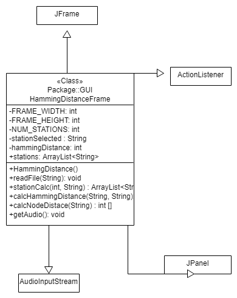

# Documentation

## Problem: 
Develop a GUI system that can calculate Hamming Distance and utilize various components and Action Listeners
in order to display stations with same hamming distance and nodes.

## Problem Solving: 
My intial thoughts were how to organize the GUI system, I was unsure of how to put the panels in the JFrame and
eventually came to the conclusion of using a BorderLayout to structure my Frame. I worked methodically through my project and then 
saw that BorderLayout was a highly ineffective way to structure my Frame. I then lessened the amount of Panels I had and had fewer
BorderLayouts to format my Frame better

HammingDistanceFrame class

The class constants and objects

Here I added my components and a few class constants that I needed through implementation

# Constructor

	This is the big one, the method that I put a majority of my implementation in. I created my frame, added ActionListeners, 
	did formatting, and added panels in this constructor. I then added my components and finally displayed my frame. This method
	took a lot of time and effort, for it was difficult to figure out my formatting issues with respect to my JFrame. When I finally
	was able to visualize my JFrame and Panel formatting, I was able to get a grip on the concept better. 

# Helper Methods
	I decided that my constructor would absolutely be way too crowded if I loaded it up with too many lines, so I divided
	up the work a tad to lessen the load. I had methods to get the Hamming Distance, the Node distance, to read the file, 
	and to read in an Audio File. These methods were relatively easy, as they were somewhat the same as previous projcets. 

# Main
	Here I created the new frame in order to display it.

